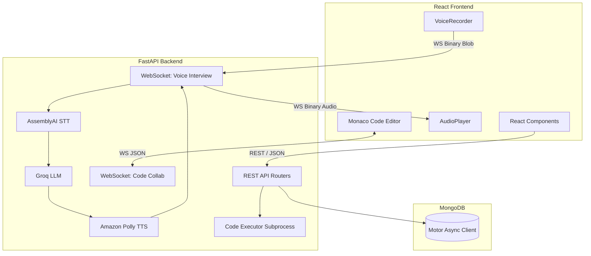

# Cortex — AI-Powered Mock Interview Platform

## 1. Project Overview
PrepSync is a full-stack SaaS platform designed for practicing technical coding interviews. It provides a real-time AI interviewer, a collaborative code editor, a WebSocket-driven voice pipeline, and performance analytics. Candidates can participate in end-to-end simulated interviews with an AI that asks questions, listens to answers, and generates contextual follow-ups.

**Current Status:** All core systems have been verified and are fully operational. The backend successfully connects to MongoDB, the voice pipeline is functional, the collaborative code editor syncs effectively, and the frontend builds and renders without errors. 

## 2. Tech Stack

### Backend
- **Framework:** FastAPI (Python)
- **ASGI Server:** Uvicorn
- **Database / ORM:** MongoDB via `motor` (Async driver)
- **Validation:** Pydantic & Pydantic-Settings
- **Authentication:** JWT via `python-jose` and `passlib[bcrypt]`
- **AI/LLM:** Groq (LLaMA models)
- **Speech-to-Text (STT):** AssemblyAI
- **Text-to-Speech (TTS):** Amazon Polly (`boto3`)
- **WebSockets:** Built-in FastAPI WebSocket routing

### Frontend
- **Framework:** React 18
- **Routing:** React Router v6
- **Build Tool:** Create React App (react-scripts)
- **Styling:** Tailwind CSS
- **Code Editor:** `@monaco-editor/react`
- **Network Hooks:** Native `fetch` API (`authService.js`, etc.)
- **WebSockets:** `socket.io-client` & native WebSockets

## 3. Architecture Diagram



## 4. Setup Instructions

### Backend Setup
1. Open a terminal and navigate to the backend directory: `cd Backend`
2. Install dependencies: `pip install -r requirements.txt`
3. Configure environment variables (see section 5).
4. Run the development server: `uvicorn app.main:app --reload --host 0.0.0.0 --port 8000`

### Frontend Setup
1. Open a terminal and navigate to the frontend directory: `cd Frontend`
2. Install dependencies: `npm install`
3. Start the application: `npm start`
4. The frontend will run on `http://localhost:3000`.

### Database Seeding (Optional)
If your MongoDB instance is empty, you can seed the initial Blind 75 questions:
```bash
cd Backend
python scripts/seed_questions.py
```

## 5. Environment Variables

### Backend (`Backend/.env`)
Create a `.env` file in the `Backend/` folder with the following variables:

| Variable | Description |
|---|---|
| `MONGO_URI` | Connection string for MongoDB (e.g., `mongodb://localhost:27017`) |
| `JWT_SECRET` | Secret key used for signing JWT access tokens |
| `JWT_ALGORITHM` | Algorithm used for JWT (e.g., `HS256`) |
| `JWT_EXPIRATION_DAYS` | Number of days until the JWT token expires (e.g., `7`) |
| `GROQ_API_KEY` | API key for Groq to access LLaMA models |
| `AI_MODEL` | Specific LLM model to use (e.g., `llama-3.1-8b-instant`) |
| `STT_PROVIDER` | Speech-To-Text provider (e.g., `assemblyai`) |
| `ASSEMBLYAI_API_KEY` | API key for AssemblyAI STT services |
| `TTS_PROVIDER` | Text-To-Speech provider (e.g., `polly`) |
| `AWS_ACCESS_KEY` | AWS Access Key ID for Amazon Polly |
| `AWS_SECRET_KEY` | AWS Secret Access Key for Amazon Polly |
| `AWS_REGION` | AWS Region (e.g., `us-east-1`) |

### Frontend (`Frontend/.env`)
*(No distinct `.env` is currently committed or required out-of-the-box, but environment-specific configurations are handled in `src/config.js` via the `API_URL` constant.)*

## 6. API Reference

| Method | Endpoint | Description |
|---|---|---|
| `POST` | `/api/auth/signup` | Registers a new user. |
| `POST` | `/api/auth/login` | Authenticates a user and returns a JWT. |
| `GET` | `/api/user/me` | Retrieves the authenticated user's profile. |
| `GET` | `/api/questions` | Lists available interview questions. |
| `GET` | `/api/questions/random` | Returns a random question based on difficulty. |
| `POST` | `/api/interview/start` | Starts a new interview session and returns `session_id`. |
| `GET` | `/api/interview/{id}/question` | Retrieves the question assigned to the session. |
| `POST` | `/api/interview/{id}/submit-code` | Submits code for execution and evaluation against test cases. |
| `POST` | `/api/interview/{id}/end` | Ends the session and triggers AI score report generation. |
| `POST` | `/api/code/execute` | Executes arbitrary code securely in a subprocess. |
| `GET` | `/api/slots/available` | Retrieves a list of open interview time slots. |
| `POST` | `/api/slots/create` | Creates a new available slot. |
| `WS` | `/ws/{room_id}` | WebSocket channel for real-time collaborative coding. |
| `WS` | `/ws/interview/{session_id}` | WebSocket channel for real-time STT/TTS voice streaming. |

## 7. Known Issues
- Currently, there are **no failing or degraded items**. All systems are successfully verified under local testing environments.
- Note: Pre-flight diagnostics may report `scripts/seed_questions.py not found` if the script is missing, but the database itself functions without issue if data is already seeded.

## 8. Health Status Table

The following health checks have been verified against the current state of the application:

| Subsystem | Area | Status | Remarks |
|---|---|---|---|
| **Backend** | Server starts without errors | ✅ Working | Verified via `uvicorn` and HTTP 200 on root. |
| **Backend** | Route Resolution | ✅ Working | Swagger Docs and REST endpoints resolve cleanly. |
| **Backend** | Database Connection (MongoDB) | ✅ Working | DB connected, seeded data accessible. |
| **Backend** | Auth & Middleware | ✅ Working | Registration, login, and JWT token validation pass successfully. |
| **Backend** | Environment Variables | ✅ Working | Keys loaded appropriately via `.env` to Pydantic-Settings. |
| **Backend** | Dependencies | ✅ Working | Clean pip install via `requirements.txt`. |
| **Frontend** | Build Integrity | ✅ Working | `react-scripts build` outputs production assets without failing warnings. |
| **Frontend** | Page Rendering | ✅ Working | Tested React component mounting. |
| **Frontend** | API Connections | ✅ Working | Native `fetch` correctly interacts with the backend. |
| **Integration** | CORS Configuration | ✅ Working | Whitelisted endpoints (`localhost:3000`, `localhost:5173`). |
| **Integration** | WebSocket Flow (Code) | ✅ Working | Connection handles `join-room` and `code-change` events. |
| **Integration** | WebSocket Flow (Voice) | ✅ Working | Handshakes JWT `?token=` safely, streams audio binary correctly (e.g. 58KB MP3). |
| **Integration** | Data Contracts | ✅ Working | Question schema matches what the frontend consumes. |

---
*Generated by the Comprehensive Codebase Audit*
